# tutoring-process-analysis
## Overview
This project analyses and improves the student enrolment and onboarding process at a tutoring centre.

## Problem
The existing process relied on manual coordination, leading to:
- Delays in communication with parents
- Scheduling conflicts
- Lack of visibility across systems

## Analysis
Mapped the end-to-end workflow from enquiry to enrolment and attendance tracking to identify inefficiencies and bottlenecks.

## Solution
Proposed a streamlined and structured process to:
- Improve coordination between stakeholders
- Reduce manual errors in scheduling and enrolment
- Enhance overall workflow efficiency

## Impact
The proposed improvements aim to:
- Reduce administrative effort
- Improve communication speed and clarity
- Increase operational efficiency

## Process Diagram

